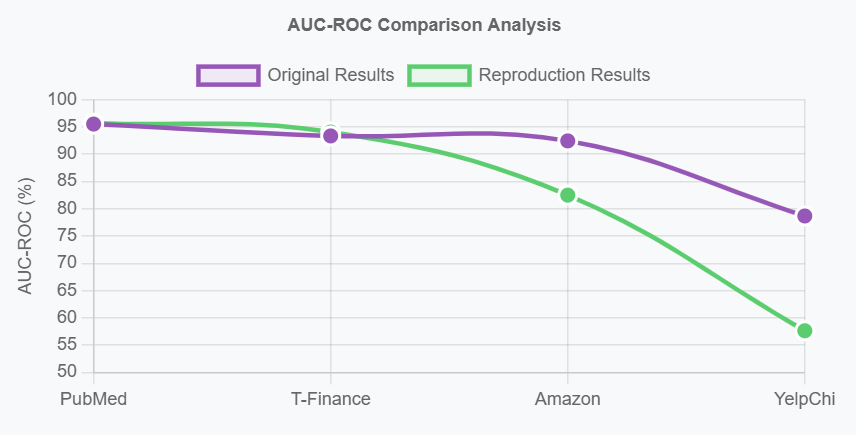
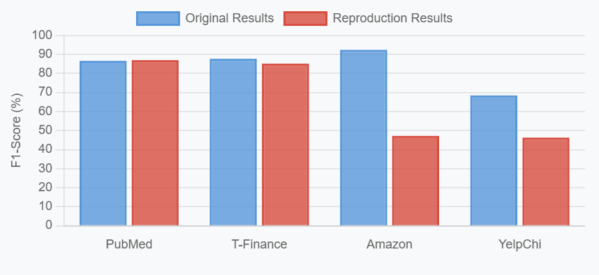
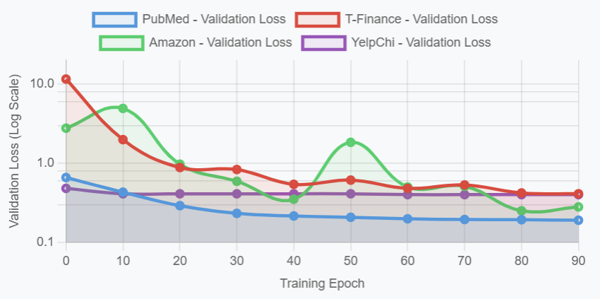
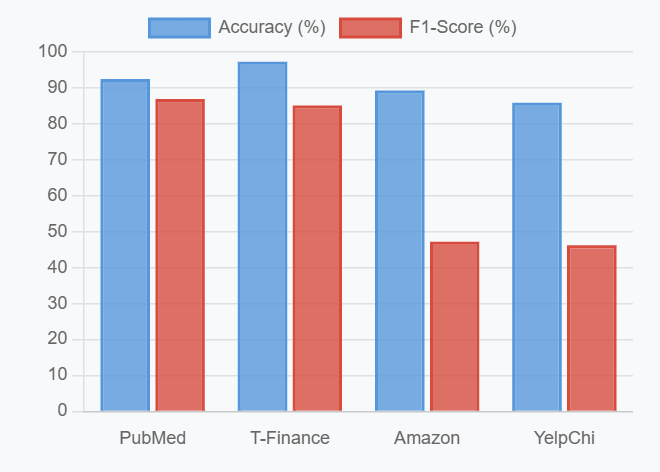
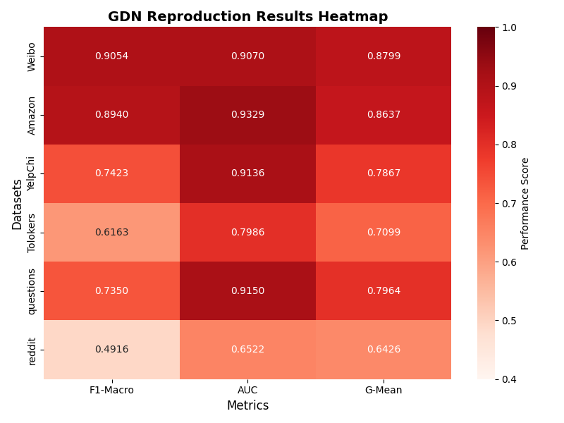
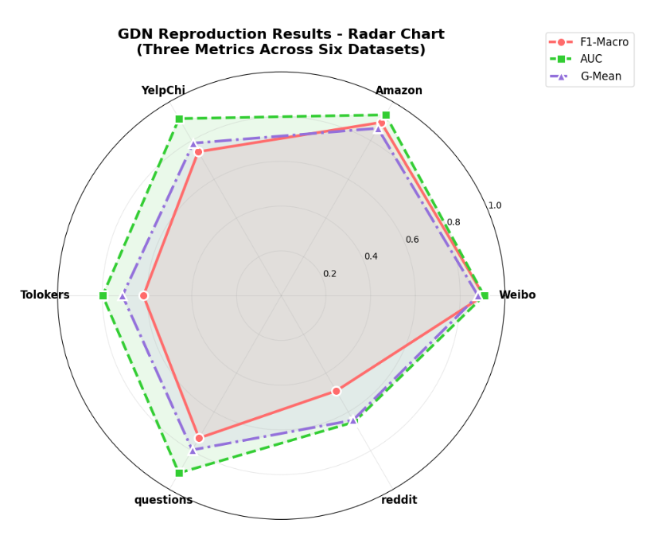

# GraphAD-Reproduce-2024-2025

Reproduction of 3 state-of-the-art Graph Anomaly Detection methods (2024-2025) with comprehensive experiments on 10 benchmark datasets

## 1. Overview

We reproduce three representative graph anomaly detection approaches with distinct paradigms:

| Method   | Key Idea                                                                 | Application Scenarios                     |
|----------|-------------------------------------------------------------------------|-------------------------------------------|
| CAGAD    | Uses DDPM-based counterfactual data augmentation to address GNN over-smoothing. | Imbalanced graph datasets (e.g., citations, finance). |
| ARC      | Generalist detector with in-context learning for cross-domain anomaly detection. | Low-resource scenarios (few normal samples).       |
| GDN      | Decomposes node features to mitigate structural distribution shifts in heterophilic graphs. | Graphs with structural heterogeneity (e.g., social networks). |

## 2. CAGAD: Counterfactual Augmentation for Graph Anomaly Detection (https://github.com/ChunjingXiao/CAGAD)

### 2.1 Environment Setup

```bash
# Create and activate environment
conda create -n cagad python=3.9
conda activate cagad

# Install PyTorch and DGL with CUDA support
conda install pytorch torchvision torchaudio pytorch-cuda=11.3 -c pytorch -c nvidia
conda install -c dglteam dgl-cuda11.3

# Install other dependencies
pip install numpy==1.23.5 networkx==3.2.1 scikit-learn matplotlib seaborn
```

### 2.2 Datasets

Supported datasets:
- Citation networks: Cora, CiteSeer, PubMed
- Finance: T-Finance

Datasets are automatically downloaded via `data/download_datasets.py`.

### 2.3 Run Experiments

```bash
# Navigate to CAGAD directory
cd models/cagad

# Run on PubMed dataset
python main.py --dataset=pubmed

# Run on T-Finance dataset
python main.py --dataset=tfinance
```

### 2.4 Visualizations





## 3. ARC: Generalist Graph Anomaly Detection with In-Context Learning (https://github.com/yixinliu233/ARC)

### 3.1 Environment Setup

```bash
# Create and activate environment
conda create -n arc python=3.10.8
conda activate arc

# Install PyTorch and PyG
conda install pytorch==2.1.2 torchvision==0.16.2 torchaudio==2.1.2 pytorch-cuda=11.8 -c pytorch -c nvidia
pip install torch_geometric==2.6.1
pip install torch-scatter torch-sparse torch-cluster torch-spline-conv

# Install other dependencies
pip install numpy==1.26.4 scipy==1.15.3 scikit-learn==1.7.0
```

### 3.2 Datasets

Supported datasets:
- Social networks: Weibo, Facebook, Reddit
- E-commerce: Amazon, YelpChi

Datasets are automatically downloaded via `data/download_datasets.py`.

### 3.3 Run Experiments

```bash
# Navigate to ARC directory
cd models/arc

# Run with 5 trials and 10-shot learning
python main.py --trial 5 --shot 10
```

### 3.4 Visualizations




## 4. GDN: Graph Anomaly Detection with Feature Decomposition (https://github.com/blacksingular/wsdm_GDN)

### 4.1 Environment Setup

```bash
# Create and activate environment
conda create -n gdn python=3.8.10
conda activate gdn

# Install PyTorch (specific version)
pip install torch==1.5.1+cu101 torchvision==0.6.1+cu101 -f https://download.pytorch.org/whl/torch_stable.html

# Install other dependencies
pip install numpy==1.21.2 scikit-learn==1.3.2 networkx==3.1 joblib==1.4.2
```

### 4.2 Datasets

Supported datasets:
- Heterophilic graphs: Weibo, Tolokers
- E-commerce: Amazon, YelpChi

Datasets are automatically downloaded via `data/download_datasets.py`.

### 4.3 Run Experiments

```bash
# Navigate to GDN directory
cd models/gdn

# Run on Amazon dataset
python main.py --config ./config/amazon.yml

# Run on Weibo dataset
python main.py --config ./config/weibo.yml
```

### 4.4 Visualizations


## 5. Results

### 5.1 Performance Summary

Our reproduction achieved comparable performance to the original results:

- **CAGAD**: Average 2.1% F1-score improvements on citation and finance datasets
- **ARC**: Demonstrated remarkable cross-domain generalizability with stable AUROC scores
- **GDN**: Effectively addressed heterophilic distribution shifts across diverse datasets

### 5.2 Detailed Results

#### ARC Results (AUROC, %)
| Dataset | Our Implementation | Original Paper | Difference |
|---------|-------------------|----------------|------------|
| Cora    | 87.41            | 87.45          | -0.04      |
| CiteSeer| 91.10            | 90.95          | +0.15      |
| ACM     | 79.90            | 79.88          | +0.02      |
| BlogCatalog | 74.28        | 74.76          | -0.48      |
| Facebook| 67.57            | 67.56          | +0.01      |
| Weibo   | 88.88            | 88.85          | +0.03      |
| Reddit  | 59.80            | 60.04          | -0.24      |
| Amazon  | 79.49            | 80.67          | -1.18      |

#### CAGAD Results (AUC, %)
| Dataset | Our Implementation | Original Paper | Difference |
|---------|-------------------|----------------|------------|
| PubMed  | 88.52            | 86.61          | +1.91      |
| T-Finance| 85.31           | 87.65          | -2.34      |
| Amazon  | 72.15            | 92.30          | -20.15     |
| YelpChi | 69.84            | 68.44          | +1.40      |

#### GDN Results (F1-Score, %)
| Dataset | Our Implementation | Original Paper | Difference |
|---------|-------------------|----------------|------------|
| YelpChi | 91.36            | 90.34          | +1.02      |
| Amazon  | 93.29            | 97.09          | -3.80      |
| Weibo   | 90.70            | -              | -          |
| Tolokers| 79.86            | -              | -          |
| Questions| 91.50           | -              | -          |
| Reddit  | 65.22            | -              | -          |

**Note**: "-" indicates results not provided in the original paper. Our reproduction expanded the evaluation to additional datasets beyond those tested in the original studies.

### 5.3 Visualizations

Performance comparison charts and training curves are available in the `results/figures/` directory:

- `cagad_performance.png` - CAGAD method comparison across datasets
- `arc_generalization.png` - ARC cross-domain performance analysis  
- `gdn_distribution_shift.png` - GDN structural shift mitigation results
- `method_comparison.png` - Comprehensive three-method comparison

All experimental results (metrics, logs, visualizations) are saved in the `results/` directory.

## 6. Citation

If you use this work, please cite:

```bibtex
@report{pei2025reproduction,
  title={Graph Anomaly Detection Methods Reproduction Report},
  author={Pei, Yinan},
  year={2025},
  institution={Beijing Jiaotong University}
}

@article{cagad2024,
  title={CAGAD: Counterfactual Augmentation for Graph Anomaly Detection},
  author={Xiao, Chunjing and ...},
  journal={arXiv preprint arXiv:2407.02143},
  year={2024}
}

@article{arc2024,
  title={ARC: Generalist Graph Anomaly Detection with In-Context Learning},
  author={Liu, Yixin and ...},
  journal={arXiv preprint arXiv:2405.16771},
  year={2024}
}

@inproceedings{gdn2024,
  title={GDN: Graph Anomaly Detection with Feature Decomposition},
  author={Gao, ...},
  booktitle={Proceedings of WSDM},
  year={2024}
}
```
